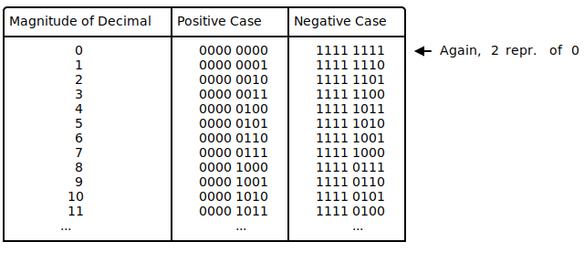
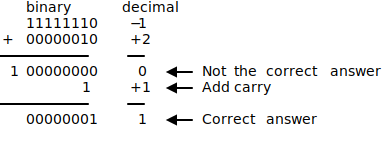

### Ones' Complement

To overcome the limitations of the *Sign and Magnitude* representation,
another representation was developed with the following idea in mind: 
One wants to flip the sign of an integer by inverting all its bits. 

This inversion is also known as taking the complement of the bits. 
The implication of this idea is, that the first bit, the MSB, also 
represents just the sign as in the *Sign and Magnitude* case. 
However, the decimal value of all other bits are now dependent of 
the MSB bit state. It might be easier to understand this behavior 
by a simple example that outlines the motivation again.

We want that our binary representation behaves like:

<p align="center">  </p>

<!--
```bob
.----------------------+---------------+---------------.
|"Magnitude of Decimal"|"Positive Case"|"Negative Case"|
|----------------------|---------------|---------------|    
|         "0"          |   0000 0000   |   1111 1111   | <- "Again, 2 repr. of 0"
|         "1"          |   0000 0001   |   1111 1110   | 
|         "2"          |   0000 0010   |   1111 1101   | 
|         "3"          |   0000 0011   |   1111 1100   | 
|         "4"          |   0000 0100   |   1111 1011   | 
|         "5"          |   0000 0101   |   1111 1010   | 
|         "6"          |   0000 0110   |   1111 1001   | 
|         "7"          |   0000 0111   |   1111 1000   | 
|         "8"          |   0000 1000   |   1111 0111   |
|         "9"          |   0000 1001   |   1111 0110   |
|        "10"          |   0000 1010   |   1111 0101   |
|        "11"          |   0000 1011   |   1111 0100   |
|       "..."          |        "..."  |        "..."  |
+----------------------+---------------+---------------+
```
-->

The advantage of this representation is that for adding two numbers, one
can do a conventional binary addition, but it is then necessary to do an
end-around carry: that is, add any resulting carry back into the
resulting sum. To see why this is necessary, consider the following
example showing the case of the following addition 
$$
−1_{10} + 2_{10}
$$

or 

$$
1111 1110_2 + 0000 0010_2
$$

<p align="center"></p>

<!--
```bob
   "binary"    "decimal"
   11111110     −1
+  00000010     +2
───────────     ──
 1 00000000      0   <-- "Not the correct answer"
          1     +1   <-- "Add carry"
───────────     ──
   00000001      1   <-- "Correct answer"

```
-->

In the previous example, the first binary addition gives `00000000`, which
is incorrect. The correct result (`00000001`) only appears when the carry
is added back in.

A remark on terminology: The system is referred to as *ones' complement*
because the negation of a positive value x (represented as the bitwise
NOT of x, we will discuss the bitwise NOT in the following sections) 
can also be formed by subtracting x from the ones' complement
representation of zero that is a long sequence of ones (−0).

