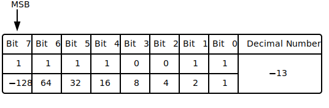
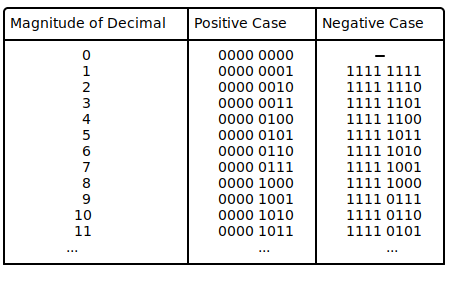

### Two's Complement

In the two's complement representation, a negative number is represented
by the bit pattern corresponding to the bitwise NOT (i.e. the
"complement") of the positive number plus one, i.e. to the ones'
complement plus one. It circumvents the problems of multiple
representations of 0 and the need for the end-around carry of the ones'
complement representation. 

This can also be thought of as the most significant bit representing the
inverse of its value in an unsigned integer; in an 8-bit unsigned byte,
the most significant bit represents the number 128, where in two's
complement that bit would represent −128.

<p align="center"> </p>

<!--
```bob
  MSB                                      
   |                                       
   v                                     
.-----+-----+-----+-----+-----+-----+-----+-----+----------------.
|Bit 7|Bit 6|Bit 5|Bit 4|Bit 3|Bit 2|Bit 1|Bit 0| Decimal Number | 
+-----+-----+-----+-----+-----+-----+-----+-----+----------------+
|  1  |  1  |  1  |  1  |  0  |  0  |  1  |  1  |                |
|-----+-----+-----+-----+-----+-----+-----+-----+      -13       |
| -128| 64  | 32  | 16  |  8  |  4  |  2  |  1  |                |
'-----+-----+-----+-----+-----+-----+-----+-----+----------------'
```
-->

In two's-complement, there is only one zero, represented as 00000000.
Negating a number (whether negative or positive) is done by inverting
all the bits and then adding one to that result. 

Addition of a pair of two's-complement integers is the same as addition
of a pair of unsigned numbers. The same is true for subtraction and even
for the \(N\) lowest significant bits of a product (value of multiplication).
For instance, a two's-complement addition of 127 and −128 gives the same
binary bit pattern as an unsigned addition of 127 and 128, as can be
seen from the 8-bit two's complement table.


<p align="center"> </p>

<!--
```bob
.----------------------+---------------+---------------.
|"Magnitude of Decimal"|"Positive Case"|"Negative Case"|
|----------------------|---------------|---------------|    
|         "0"          |   0000 0000   |       -       | 
|         "1"          |   0000 0001   |   1111 1111   | 
|         "2"          |   0000 0010   |   1111 1110   | 
|         "3"          |   0000 0011   |   1111 1101   | 
|         "4"          |   0000 0100   |   1111 1100   | 
|         "5"          |   0000 0101   |   1111 1011   | 
|         "6"          |   0000 0110   |   1111 1010   | 
|         "7"          |   0000 0111   |   1111 1001   | 
|         "8"          |   0000 1000   |   1111 1000   |
|         "9"          |   0000 1001   |   1111 0111   |
|        "10"          |   0000 1010   |   1111 0110   |
|        "11"          |   0000 1011   |   1111 0101   |
|       "..."          |        "..."  |        "..."  |
+----------------------+---------------+---------------+
```
-->

```admonish note
Two's complement is the representation that Python uses for it's
type `int`.
```

