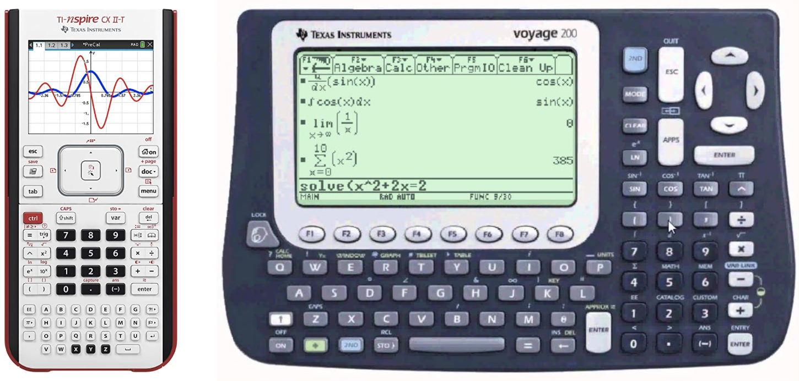

# Symbolic Computation

You may also know computer algorithms as numerical algorithms since the 
computer uses finite-precision floating-point numbers to approximate 
the result. Although the numerical result can be arbitrarily precise 
by using arbitrary-precision arithmetic, it is still an approximation. 

As humans, we use symbols to carry out computations analytically. This can also be 
realized on computers using symbolic computation. There are many so-called 
computer algebra systems (CAS) out there and you might already be familiar with 
one from school if you have used a graphing calculator there like the ones 
shown below. 



But of course, CAS is not limited to external devices but is also available as
software for normal computers. The most commonly used computer algebra systems
are Mathematica and SageMath/SymPy. We will use [SymPy](https://www.sympy.org)
in this course because it is open-source and a Python library compared to Mathematica. 
SageMath is based on Sympy and offers several additional functionalities, 
which we do not need in this class.   

To illustrate the difference between numerical and symbolic computations, 
we compare the output of the square root functions from `numpy` and `sympy`.
The code
```python
import numpy as np
print(np.sqrt(8))
```
produces `2.8284271247461903` as output, which is an approximation to the 
true value of $\sqrt{8}$, while
```python
import sympy as sp
print(sp.sqrt(8))
```
produces `2*sqrt(2)`, which is exact.

