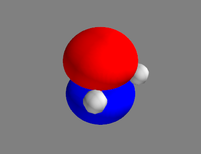
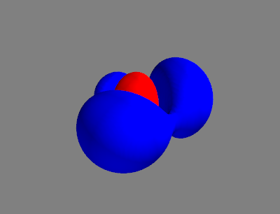

## Plotting of grid data

In the previous sections, we have implemented the Hartree-Fock method, which
delivers the molecular orbitals. These, as well as some other quantities 
derived from them, are functions of 3 spatial coordinates. In this section,
we will show how to visualise these functions in 3D space.

~~~admonish note
We will use the 
[Mayavi](https://docs.enthought.com/mayavi/mayavi/)
package to plot grid data.

This can be installed with 
```
mamba install -c conda-forge mayavi
```
If you wish to use Mayavi with Jupyter notebooks, you will need to install 
the ipyevents package with 
```
mamba install -c conda-forge ipyevents
```
~~~

### Functions for Isosurface Plotting

We start by importing the necessary packages.

```python
{{#include ../codes/05-hartree_fock/isosurface.py:imports}}
```
~~~admonish tip
If you are using Jupyter notebooks, you will need to run the following cell
to initialize Mayavi immediately after importing it:
```python
mlab.init_notebook()
```
Make sure that you get the output
```
Notebook initialized with ipy backend.
```
~~~

Molecular orbitals are one-electron wavefunctions. In our HF calculations, 
we represent them in the basis of atomic orbitals, which are themselves 
one-electron wavefunctions. To visualize them in 3D space, we need to 
evaluate them on a spatial grid. We shall at first define a function 
to evaluate a contracted Gaussian basis function in space:
```python
{{#include ../codes/05-hartree_fock/isosurface.py:evaluate_gaussian_basis_function}}
```

Of course, we have to build a spatial grid beforehand. This can be done with 
the following function:
```python
{{#include ../codes/05-hartree_fock/isosurface.py:build_grid_function}}
```

Afterwards, we define a function to transform the MOs from the AO basis 
to the position basis:
```python
{{#include ../codes/05-hartree_fock/isosurface.py:evaluate_mo_grid_function}}
```

In the end, we can define a function to plot the MOs, along with the 
atoms and bonds for reference:
```python
{{#include ../codes/05-hartree_fock/isosurface.py:constants}}
```
```python
{{#include ../codes/05-hartree_fock/isosurface.py:visualize_cube_function}}
```

### Visualizing Molecular Orbitals
Now, we can take an HF calculation of water
```python
{{#include ../codes/05-hartree_fock/mo_and_density.py:water_hf}}
```
construct a grid
```python
{{#include ../codes/05-hartree_fock/mo_and_density.py:construct_grid}}
```
and plot HOMO and LUMO of water:
```python
{{#include ../codes/05-hartree_fock/mo_and_density.py:water_mo}}
```
Just as with Matplotlib, we need to call the `show()` function to display
our figures:
```python
{{#include ../codes/05-hartree_fock/mo_and_density.py:mlab_show}}
```

~~~admonish tip
The support of Mayavi in Jupyter Notebook is limited, as each notebook cell
can only handle one Mayavi figure, and instead of calling `mlab.show()`, the
plot should be displayed. In this case, you should use the following 2 cells
to visualise HOMO and LUMO of water:

```python
fig_homo = mlab.figure()
p_homo = visualize_cube(mol, grid, mo_grid[ihomo], ORBITAL_ISOVALUES, 
                        ISOSURFACE_COLORS, fig_homo)
p_homo
```
```python
fig_lumo = mlab.figure()
p_lumo = visualize_cube(mol, grid, mo_grid[ilumo], ORBITAL_ISOVALUES, 
                        ISOSURFACE_COLORS, fig_lumo)
p_lumo
```
~~~

~~~admonish note
Since the calling of `mlab.show()` is **incompatible** with Jupyter Notebook 
(unlike with Matplotlib, where the calling of `plt.show()` is unneccesary in 
notebooks but not obstructive), we will omit it in code blocks from now on. 
Just remember to add this line to your code when using the "classic" Python.
~~~

We get figures like this:

<div class="row">
  <div class="column">
    <p style="text-align:center">
      
      HOMO
    </p>
  </div>
  <div class="column">
    <p style="text-align:center">
      
      LUMO
    </p>
  </div>
</div>

<style>
  .row {
    display: flex;
  }

  .column {
    flex: 50%;
    padding: 5px;
  }
</style>

### Visualising Electron Density

While the MOs are just mathematical constructions, the electron density is 
a measurable quantity. 

The spin-free one-electron density is defined as
$$
  \rho(r) = \int \Psi^*(x, x_2, \cdots, x_N)\ \Psi(x, x_2, \cdots, x_N) 
    \ \mathrm{d}\sigma \mathrm{d}x_2 \cdots \mathrm{d}x_N
$$
where $r$ stands for the spatial coordinate, $\sigma$ the spin 
coordinate and $x$ a combination of both of them. For a wavefunction 
expressed as a Slater determinant, this expression simplifies to 
$$
  \rho(r) = \sum_{i=1}^{N} \int \phi_i(x) \phi_i(x)\ \mathrm{d} \sigma
$$
where $\phi_i$'s are occupied spin-orbitals.

We can calculate and visualize the density using:
```python
{{#include ../codes/05-hartree_fock/mo_and_density.py:water_density}}
```

This time, we should get something like this:

<p style="text-align:center">
  
</p>

