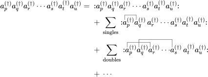

### Matrix Elements

In the last section, we have seen that matrix elements in second
quantisation are given by vacuum expectation values of strings of
ladder operators. It is probably not surprising that their is a neat
trick to evaluate such matrix elements, since the whole point of
second quantisation is to make calculations easier.

Let us at first inspect the following matrix element:
$$
	\langle \mathrm{vac} | a_{r_1}^\dagger \cdots a_{r_k}^\dagger
	a_{s_1} \cdots a_{s_l} | \mathrm{vac} \rangle
$$

Although the string is quite long, it is not hard to evaluate the matrix
element, since the right vacuum state is destroyed by the annihilation
operators and the left vacuum state is destroyed by the creation operators.

Strings in such order, i.e. with all creation operators to the left of
all annihilation operators, are called *normal ordered*. The vacuum
expectation value of a normal ordered string is always zero. We denote
a string to be normal ordered using $:\mathrel{\cdot}:$, where the dot
stands for the string. This notation introduces a sign $(-1)^p$, where 
$p$ is the number of fermionic operators that have to be passed to reach 
the normal order.

We can now define a *contraction* of two operators as the pair itself minus
the normal ordered pair, i.e.
<p align="center">
  
</p>

It is obvious that a contraction between two operators already in normal
order is zero. So the only non-zero contraction is
<p align="center">
  
</p>
A sign change occurs because the creation operator has to be moved pass one
fermion operator to reach the normal order.

A contraction between two operators separated by fermionic operators is
defined as
<p align="center">
  
</p>
So, the following example can be evaluated as
<p align="center">
  
</p>

So it seems that a contraction can simplify the string, or, to use some
technical jargons, reduce the rank of the string. It would be nice if we
could somehow represent the string as a sum of contractions. This is
precisely the statement of Wick's theorem:
<p align="center">
  
</p>
where "singles", "doubles", etc. refer to the number of pairwise contractions.

This means that we can write an arbitrary string as a sum of it normal ordered
form and all possible contractions in normal order. At first glance, this
theorem seems to be of little use, since we have made an already complicated
expression even more complicated. But since normal ordered string will always
give zero when sandwiched between two vacuum states, any term in the sum that
has a normal ordered string do not contribute to the matrix element. This
leaves us with only the terms where all the operators are pairwise
contracted, the so-called *fully contracted* strings.

So instead of painfully manipulating the string using anticommutation
relations, we can simply write down all the fully contracted strings.
Since the contraction will just give us a bunch of Kronecker deltas,
which are just numbers, we do not have to worry about how the states
look like at all. This is the power of Wick's theorem.

Let us do an example. Consider the two one-electron states
$| t \rangle = a_t^\dagger | \mathrm{vac} \rangle$ and
$| u \rangle = a_u^\dagger | \mathrm{vac} \rangle$. The matrix
element of a one-electron operator
$\hat{O}_1 = \sum_{pq} o_{pq} a_p^\dagger a_q$ can be
easily evalulated by retaining only the fully contracted strings:
<p align="center">
  
</p>
This is identical to the result we would obtain using Slater-Condon rules. 
Note that we did not really have to evaluate all possible full contractions, 
since only contractions with annihilation operators on the left and creation 
operators on the right are nonzero.

```admonish tip
There is a interesting rule about the sign of fully contracted strings. If
the number of crossings made by the lines representing contractions is even,
the overall sign is positive; if the number of crossings is odd, the overall
sign is negative.
```

These rules might work very well for particle physisists, who only have to
worry about a handful of particles. But for chemists, who have to deal with
molecular systems with hundreds of electrons. If we have to reduce all
states to the true vacuum state when evaluating matrix elements, we would
have to deal with a very very long string. This is where the concept of
Fermi vacuum comes in. Instead of using the true vacuum as the reference
we can use an arbitrary Slater determinant. To achieve this, we only have
to alter our operators a little.

Because our reference state can now contain occupied sites, not every
annihilation operator will destroy it, while some creation operators can
destroy it. Therefore, we define two classes of ladder operators, namely
particle operators and hole operators. The particle creators $a_a^\dagger$
and annihilators $a_a$ creates a particle and removes a particle,
respectively. The hole creators $a_i$ and annihilators $a_i^\dagger$ creates
a hole (by removing a particle from a occupied site) and annihilates a hole
(by adding an electron to an unoccupied site), respectively. We will adopt
the convention from now on, that the indices $i, j, k, \cdots$ refer to
occupied sites, the indices $a, b, c, \cdots$ refer to unoccupied sites, and
the indices $p, q, r, \cdots$ refer to general sites.

Since holes can not be called a particle with the best will in the world,
we shall use the more general term *quasiparticles* and call the new operators
quasiparticle operators or q-operators for short. A string is called to be
normal ordered relative to the Fermi vacuum if all the q-creators are standing
to the left of all q-annihilators. We will just call this normal ordering from 
now on.

With a bit of thought, we can see that the only nonzero contractions between
q-operators are
<p align="center">
      
</p>
Contractions with q-creators on the left and q-annihilators on the right,
as well as with mixed hole particle operators, are zero. 

So, by using q-operators instead of ordinary operators, we can work with Fermi
vacuum as we have worked with true vacuum. In many quantum chemical calculations,
the Hartree-Fock wavefunction as the reference state, which is a Slater
determinant. Therefore, Fermi vacuum and q-operators can be very useful in
deriving the expressions of matrix elements.

