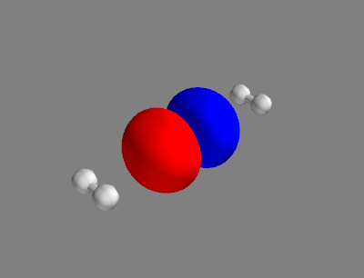

## Problem Set 3

### Problem 1

In problem set 2, you have calculated the total molecular energy 
using the extended Hückel method. Now we can use optimisation 
algorithms to minimise the molecular energy with respect to the nuclear 
coordinates to obtain (in the best case) a relaxed geometry. 

For this purpose, we shall at first optimise a model function:
$$
V(q) = \frac{\Delta}{2 q_0} (q - q_0) + 
  \frac{E^{\mathrm{TS}} - \Delta / 2}{q_0^4} (q - q_0)^2 (q + q_0)^2
$$

As an example, we shall use the following parameters
$$
\begin{align}
  q_0 &= 2 \\
  \Delta &= 1 \\
  E^{\mathrm{TS}} &= 2
\end{align}
$$

We shall first define a Python function to obtain the objective function. 
For $V(q)$, it could look like this:
```python
{{#include ../codes/psets/03/sol_1a.py:def_double_well}}
```

Note that we have set the independent variable `q` as the first argument 
of this function. This is necessary because we want to use 
the SciPy function 
[`optimize.minimize`](https://docs.scipy.org/doc/scipy/reference/generated/scipy.optimize.minimize.html), 
which requires the objective function to have the independent variable as 
its first argument. We now call `minimize` on our example function in 
combination with the BFGS optimization algorithm:
```python
{{#include ../codes/psets/03/sol_1a.py:optimise_double_well}}
```
The function `minimize` calculates the numerical gradient of the objective 
function automatically, so you do not need to provide it. 
The optimised value $q^{*}$ is stored in the attribute `x` 
of the object `res`.

**(a) Run the code for optimising `double_well` above yourself to find 
one local minimum. Adjust the initial guess `q_init` to find another 
local minimum.**

Expected results:

$q^{*}_1 = 1.9108;\quad q^{*}_2 = -2.0706$

&nbsp;

After playing around with the model function, we shall take a look at 
the water molecule from problem 1:
```python
{{#include ../codes/psets/03/sol_1bc.py:atoms_in_water}}
```
You may have noticed that the bond angle $\angle_{\mathrm{HOH}}$ is 
$90^{\circ}$ in this geometry, which is certainly not optimal.

**(b) Optimise the geometry of the water molecule listed above
using the total energy as the objective function.**

_Hint: Start by defining a function that takes the 
[flattened](https://numpy.org/doc/stable/reference/generated/numpy.ndarray.flatten.html) 
coordinate array (which should have 9 elements) as its first argument and 
everything else you need to construct a molecule as the remaining arguments. 
This function should construct a molecule using the coordinates you provide 
and calculate the total energy as its return value. Afterwards, call 
`minimize` on this function using the coordinates given in problem 1 as an initial guess._

&nbsp;

**(c) Calculate the bond length $r_{\mathrm{OH}}$ and the bond angle 
$\angle_{\mathrm{HOH}}$ of the optimised geometry.**

Expected results:

$r_{\mathrm{OH}} = 0.9819\ \mathrm{\AA};\quad \angle_{\mathrm{HOH}} = 102.4^\circ$

&nbsp;

---


### Problem 2

We have implemented the Hartree-Fock method in the lecture, which leads to 
convergence for the example molecules we tested. However, the convergence 
is not guaranteed in general. Apart from "difficult" molecules, the HF 
routine can also have convergence problems for distorted geometries of 
"easy" molecules. In this problem, we shall investigate the convergence 
behavior of the HF method for the stretched water molecule and implement 
a simple trick to improve the convergence.

The stretched water molecule is constructed using the following atoms:
```python
{{#include ../codes/psets/03/sol_2.py:stretched_water_molecule}}
```
```admonish tip
You will have to make slight modifications to the `HartreeFock` class 
for this problem.
```
```admonish note
If not mentioned otherwise, use the STO-3G basis set and perform a 
maximum of 100 iterations with a convergence 
threshold of \\(10^{-6}\ \mathrm{a.u.}\\) for the energy difference 
for all calculations in this problem.
```

**(a) Perform an HF calculation for the stretched water molecule.
Plot the SCF energy as a function of the iteration number.**

Expected result:


&nbsp;

The SCF procedure oscillates and fails to converge. To mitigate 
this problem, we can use a damping scheme. The simplest of which is 
linear damping, where the density matrix from each iteration is 
replaced with a linear combination of the density matrix from the 
previous iteration and the current iteration
via the damping parameter \\(\alpha\\):
$$
  P_n \leftarrow \alpha P_{n-1} + (1 - \alpha) P_n
$$

**(b) Implement the linear damping scheme in the `HartreeFock` class. 
Perform an HF calculation for the stretched water molecule using 
linear damping with \\(\alpha = 0.5\\). Plot the SCF energy as a 
function of the iteration number.**

*Hint: When setting a variable to an `np.array`, you have to explicitly 
copy the array, e.g. `p_old = np.copy(p)`.*

Expected result:


```admonish note
Depending on the position in the SCF procedure where the damping 
is applied, the precise energy values and the number of iterations 
can vary slightly. You do not have to tweak your implementation to 
match the expected result exactly, as long as the general behavior 
is the same.
```
&nbsp;

**(c) Perform HF calculations of the stretched water molecule using 
linear damping with \\(\alpha = 0.00, 0.02, 0.04, \ldots, 0.98\\). 
Set the maximum number of iterations to 200 and plot the number of 
iterations performed as a function of \\(\alpha\\).**

Expected result:


```admonish note
> Again, the precise number of iterations can vary slightly. You do 
> not have to tweak your implementation to match the expected result 
> exactly, as long as the general behavior is the same.
```

```admonish info
The linear damping scheme is a very simple method to improve the 
convergence of the SCF procedure. More sophisticated damping schemes, e.g. 
[Anderson acceleration](https://en.wikipedia.org/wiki/Anderson_acceleration), 
can be used to further improve the convergence behavior.
</span>
```

&nbsp;

---

### Problem 3

We performed the CIS calculation for the water molecule in the lecture,
which gave us the energy as well as the character of the excited states. From
the orbital contributions, we could see that many excited states are mixtures
of singly excited determinants. Although for water with a minimal basis set,
this mixture is "enforced" by the spin symmetry, when we use a reasonably
sized basis set, mixed excitations that are not due to spin symmetry are very
often found. In this problem, we shall investigate one of such mixed 
excitations and learn a concept that may lead to a simpler description of
these states.

Let us consider a trimer of hydrogen molecules:
```python
{{#include ../codes/psets/03/sol_3.py:h6_molecule}}
```

**(a) Perform a CIS calculation for this molecule using the STO-3G basis set.**

&nbsp;

The first 3 excited singlet states of this molecule are states 10, 11, and 12
from the above calculation and should have the following console output:
```txt
Excited State  10: E_exc =    26.9541 eV
1a   -> 3a      -0.473982 (22.5 %)
1b   -> 3b      -0.473982 (22.5 %)
2a   -> 4a      -0.447552 (20.0 %)
2b   -> 4b      -0.447552 (20.0 %)

Excited State  11: E_exc =    27.0500 eV
1a   -> 4a      -0.471472 (22.2 %)
1b   -> 4b      -0.471472 (22.2 %)
2a   -> 3a      -0.453249 (20.5 %)
2b   -> 3b      -0.453249 (20.5 %)

Excited State  12: E_exc =    27.2722 eV
2a   -> 5a       0.636639 (40.5 %)
2b   -> 5b       0.636639 (40.5 %)
```
```admonish tip
The absolute sign of the coefficients is not important, as long as their
relative signs within one state are correct.
```

**(b) Plot the 2. and 5. MO (0-based index of spatial orbitals).**

Expected results:

<style>
  .row {
    display: flex;
  }

  .column {
    flex: 50%;
    padding: 5px;
  }
</style>

<div class="row">
  <div class="column">
    <p style="text-align:center">
      
      <br>
      MO 2
    </p>
  </div>
  <div class="column">
    <p style="text-align:center">
      
      <br>
      MO 5
    </p>
  </div>
</div>

```admonish tip
The sign of the MOs does not matter.
```

&nbsp;

The orbital contributions can be better organised in a matrix, the so-called
transition density matrix $\bm{T^{n}}$, with $n$ being the excited state number.
Let $i$ denote the index of the occupied orbitals and $a$ the index of the
virtual orbitals. The matrix element $T^{n}_ {ia}$ is the coefficient of the 
determinant corresponding to the excitation $i \to a$, i.e.
$$
  T^{n}_{ia} = \braket{\Phi_0 | \Phi_i^a}\,.
$$
Because the number of occupied and virtual orbitals are usually different, the
transition density matrix is in general not square.


**(c) Construct the transition density matrices for state 12 ($\bm{T}^{12}$).**

*Hint: All the information you need is stored in the attributes `cis_states`.*

Expected results:

Plotting the squared elements of the transition density matrix using
[matshow](https://matplotlib.org/stable/api/_as_gen/matplotlib.pyplot.matshow.html)
yields
<p style="text-align: center;">
  
</p>

&nbsp;

There are two distinct regions in the transition density matrix with
non-zero elements, indicating that this excited state is a mixture of 2
spin-adapted singly excited determinants (or 4 "primitive" determinants).
Because the MOs are optimised for the ground state, they are not necessarily
optimal for the description of the excited states. Knowing the transition 
density matrix, we can construct a new set of orbitals as linear combinations
of the original MOs. Usually, we would diagonalise the transition density 
matrix, just like we would do for the Fock matrix in the SCF procedure or the
CIS matrix in the CIS calculation. However, because the transition density
matrix is not square, we cannot directly diagonalise it. Instead, we can do
the next best thing: 
[singular value decomposition](https://en.wikipedia.org/wiki/Singular_value_decomposition)
(SVD). This procedure decomposes the transition density matrix into 3
matrices:
$$
  \bm{T^{n}} = \bm{U} \bm{\Sigma} \bm{V}^T\,,
$$
where $\bm{U}\in \R{N_{\mathrm{occ}}}{N_{\mathrm{occ}}}$ and 
$\bm{V}\in \R{N_{\mathrm{virt}}}{N_{\mathrm{virt}}}$ are orthogonal matrices,
and $\bm{\Sigma}\in \R{N_{\mathrm{occ}}}{N_{\mathrm{virt}}}$ is a rectangular
matrix with the square root of singular values on its diagonal. 
The columns of $\bm{U}$ and $\bm{V}$ are called the left and right singular
vectors, respectively, corresponding to the singular values on the diagonal of
$\bm{\Sigma}$.

**(d) Perform the SVD on $\bm{T}^{12}$ and inspect the singular values.**

*Hint: The function
[np.linalg.svd](https://numpy.org/doc/stable/reference/generated/numpy.linalg.svd.html)
could be helpful.*

Expected results:

Singular values:
|        |        |        |        |        |        |
|--------|--------|--------|--------|--------|--------|
| 0.7071 | 0.7071 | 0.0000 | 0.0000 | 0.0000 | 0.0000 |

&nbsp;


We now define a new set of orbitals as
$$
  \begin{align}
    \phi_j^{\mathrm{occ}}(x) &= \sum_i \phi_i(x)\ U_{ij} \\
    \phi_b^{\mathrm{virt}}(x) &= \sum_a \phi_a(x)\ V_{ab}\,,
  \end{align}
$$
where $i$ and $a$ run over the occupied and virtual orbitals, respectively.
The new orbitals are called the natural transition orbitals (NTOs), with 
$\phi_j^{\mathrm{occ}}$ being called the hole NTOs and $\phi_b^{\mathrm{virt}}$
being called the particle NTOs. 
The hole and particle NTOs come in pairs. The corresponding squared 
singular value of each NTO pair is its weight in the excited state.

Because our MOs are ordered with alternating spins, the NTOs will also be
ordered in this way. Therefore, the singular value of $1/\sqrt{2}$ for the
first two NTO pairs indicates that the excited state can be described as a 
mixture of the first 2 NTO pairs, which have the same spatial shape but 
different spins. This excited state is thus, ignoring the spin, a pure state 
in the NTO basis, although it is a mixed state in the MO basis.

**(e) Calculate the NTOs for excited state 12 and plot the 0. NTO pair. 
Interpret the result.**

Expected results:

<style>
  .row {
    display: flex;
  }

  .column {
    flex: 50%;
    padding: 5px;
  }
</style>

<div class="row">
  <div class="column">
    <p style="text-align:center">
      
      <br>
      NTO 0 (hole)
    </p>
  </div>
  <div class="column">
    <p style="text-align:center">
      
      <br>
      NTO 0 (particle)
    </p>
  </div>
</div>


```admonish tip
The sign of the NTOs does not matter.
```

